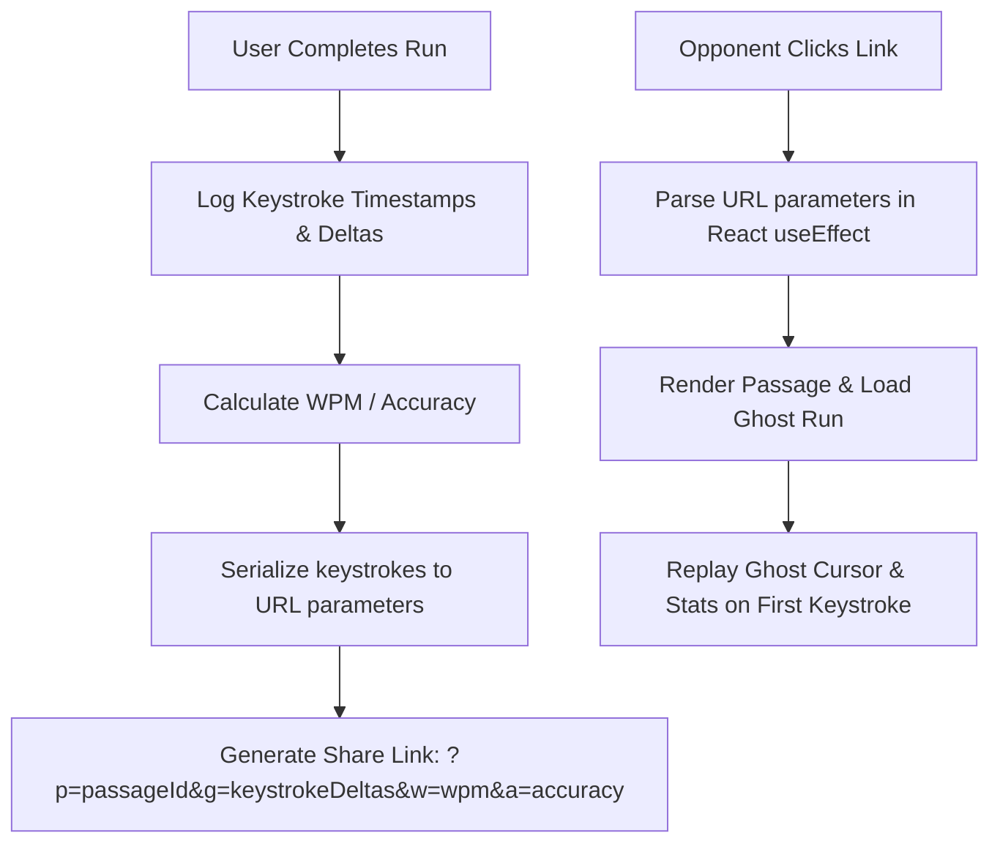

# KeyClash ⌨️

> Asynchronous keyboard typing duels with live mechanical thocks. Built entirely serverless.

KeyClash (or **Thockdown**) is a minimalist, distraction-free typing platform designed for asynchronous typing races. It bridges the gap between solo speed practice (e.g., Monkeytype) and live multiplayer platforms (e.g., TypeRacer) by introducing **Asynchronous Ghost Racing** and **Synthesized Keyboard Acoustics ("Thocks")**.

Try it out locally or deploy it to a free host in minutes!

---

## 🚀 Key Features

*   **Asynchronous Ghost Racing 👻**: Race against a visual "ghost" cursor of a friend's past run. The ghost replays their exact typing flow, including their pauses, mistakes, backspaces, and corrections.
*   **100% Serverless & Database-Free 🔗**: Your typing runs are encoded, compressed, and shared entirely through URL query parameters. No user accounts, database setups, or cloud fees required.
*   **Web Audio API Switch Synthesis 🔊**: KeyClash synthesizes realistic mechanical keyboard acoustics in real-time. Since it uses oscillators, noise filters, and gain nodes, it features **zero network audio latency** and supports keydown/keyup return strokes:
    *   *Creamy POM (Lubed Linear)*: Bassy, smooth, satisfying deep pop ("thock").
    *   *Blue Clicky*: Crisp, sharp, tactile snap.
    *   *Retro Buckling Spring*: Crunchy vintage metallic clack with spring ping.
    *   *Brown Tactile*: Soft, rounded acoustic bump.
    *   *Silent Linear*: Muffled, quiet low-frequency housing thud.
*   **Gliding Cursors ⚡**: Smooth, hardware-accelerated gliding carets that flow seamlessly across characters.
*   **Premium Themes 🎨**: Easily toggle visual styles (Creamy Obsidian, Nord Frost, Cyberpunk 2077, Retro Typewriter, Matrix Terminal, Sunset Violet) that update variables globally.
*   **Native SVG Progress Charts 📊**: Analyze your typing speed progression. Renders a custom, high-performance SVG line chart comparing your real-time WPM timeline directly against the ghost's.
*   **Custom Passage Challenge ✏️**: Paste custom texts (code snippets, essays, poetry) to type and generate custom duel links for friends.

---

## 🛠️ Architecture & Sharing Flow

KeyClash records every keystroke event as a time delta `dt` relative to the previous keypress. A completed run of ~150 key actions yields a small compressed payload (under 1KB) which is encoded directly in the URL:



---

## 💻 Tech Stack

*   **Framework**: Next.js 16 (App Router)
*   **Language**: TypeScript
*   **Styling**: CSS Modules
*   **Audio**: Web Audio API (Native browser synthesis)
*   **Deployment**: Static / Vercel Edge Serverless

---

## ⚙️ Local Development Setup

To run KeyClash locally on your computer, ensure you have [Node.js](https://nodejs.org) installed, then:

1.  **Clone or download the project** into a directory.
2.  **Install dependencies**:
    ```bash
    npm install
    ```
3.  **Start the development server**:
    ```bash
    npm run dev
    ```
4.  **Open the app**: Navigate to [http://localhost:3000](http://localhost:3000) in your web browser.

---

## ☁️ Free Deployment Guide

Since KeyClash has no database requirements, it runs on any free hosting platform:

### Option A: Vercel (Easiest & Native)
Vercel automatically detects Next.js configurations:
1. Push your code to **GitHub**.
2. Log in to [Vercel](https://vercel.com) and import your repository.
3. Click **Deploy**. Vercel will build the project and issue a free SSL-secured `.vercel.app` domain.

### Option B: Cloudflare Pages
1. Log in to [Cloudflare Dashboard](https://dash.cloudflare.com/) > **Workers & Pages**.
2. Click **Create application** > **Pages** > **Connect to Git**.
3. Choose your repository, select **Next.js** as your framework preset, and click **Save and Deploy**.

---

## 📝 License
This project is open-source and free to adapt for personal or educational purposes.
